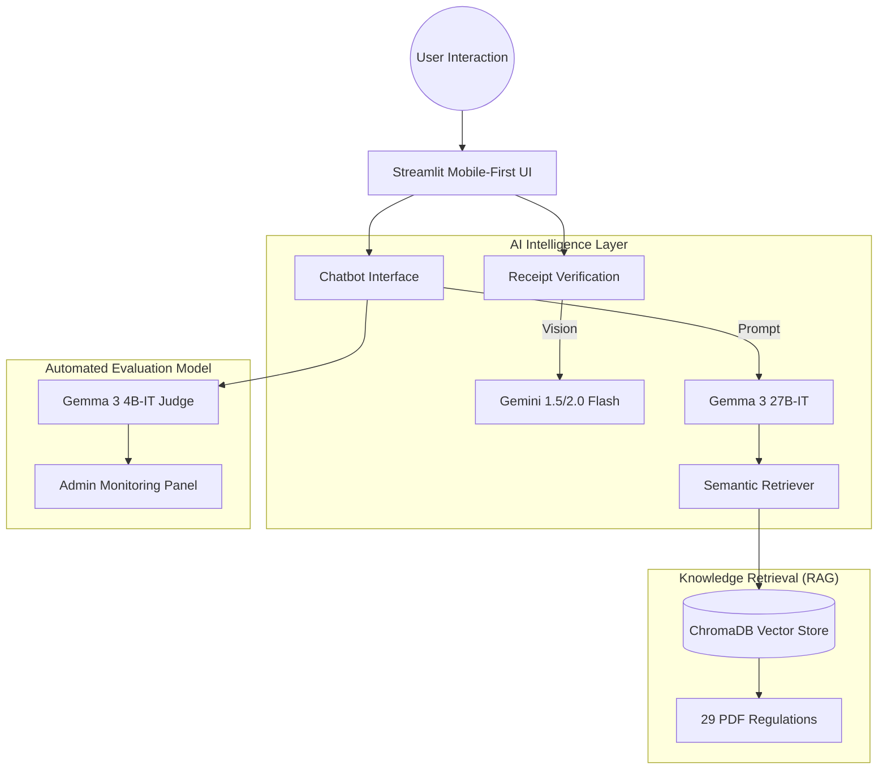

# 🎓 KMITL Budget AI Chatbot (CEIPP)
> **"Intelligent Compliance & Disbursement Analysis for Institutional Finance"**

[](https://blog.google/technology/ai/gemma-3-open-model/)
[](https://opensource.org/licenses/MIT)

**CEIPP** is an advanced AI assistant designed to bridge the gap between complex government procurement regulations and institutional operational efficiency at King Mongkut's Institute of Technology Ladkrabang (KMITL). By leveraging **Generative AI** and **Retrieval-Augmented Generation (RAG)**, it automates receipt verification and provides instant, source-grounded regulatory consultation.

---

## 🌟 Core Intelligence Modules

### 1. 👁️ Smart OCR Auditor (Vision AI)
- **Multimodal Extraction**: Utilizes **Google Gemini 1.5 Flash** to extract high-fidelity Thai text from receipts and tax invoices.
- **5-Point Compliance Check**: Automated validation of Vendor details, Transaction dates, Total amounts, Buyer identification, and mandatory Signatures/Stamps.
- **Smart Priority Logic**: Intelligent bypass for certified corporate vendors (e.g., Makro, 7-11), reducing administrative bottlenecks for computer-generated invoices.

### 2. 💬 Regulatory Consultant (RAG Chatbot)
- **Extensive Knowledge Base**: Indexed repository of **29 official KMITL and Ministry of Finance PDFs**.
- **Evidence-Grounded Answers**: Every response includes **Filename and Page Number** citations to ensure maximum transparency.
- **Thai-Optimized Retrieval**: Custom regex-based text cleaning minimizes character corruption, ensuring precise semantic search results for the Thai language.

### 3. 📊 Admin Monitoring & AI Evaluation
- **LLM-as-a-Judge Framework**: Employs **Gemma 3 4B** to quantitatively evaluate AI performance across **Faithfulness (4.51/5.0), Answer Relevance (4.45/5.0), and Context Precision (4.02/5.0)**.
- **Benchmarked Performance**: Achieving **91.64% Avg Recall@10** and **0.75 MRR** across a comprehensive 323-item golden dataset.
- **Real-time Analytics**: Interactive dashboard visualizing user feedback trends, approval distributions, and RAG accuracy benchmarks.

---

## 🏗️ System Architecture

The project implements a hybrid offline/online pipeline to ensure both data privacy and high-speed inference.



---

## 🛠️ Technical Stack

| Layer | Component | Technology |
|---|---|---|
| **Frontend** | UI Framework | Streamlit |
| **Logic** | Language Model | Gemma 3 (via OpenRouter API) |
| **Vision** | OCR Engine | Google Gemini 1.5 Flash (Native SDK) |
| **Storage** | Vector Database | ChromaDB (Persistent SQLite) |
| **Language** | Thai NLP | sentence-transformers/paraphrase-multilingual |
| **Deployment** | Infrastructure | Python 3.10+ / Streamlit Community Cloud |

---

## 🚀 Installation & Setup

### 1. Prerequisite Environments
```bash
git clone https://github.com/Ratthabhumi/CEIPP.git
cd CEIPP
pip install -r requirements.txt
```

### 2. Configure API Credentials
Create a `.streamlit/secrets.toml` file or provide keys via the application sidebar:
```toml
OPENROUTER_API_KEY = "your_openrouter_key"
GEMINI_API_KEY = "your_gemini_key"
```

### 3. Initialize & Run
```bash
streamlit run app.py
```
*Note: The system will automatically build the ChromaDB vector database upon first execution (requires 29 PDF documents in the `./Docs` folder).*

---

## 📑 Included Regulations (29 Documents)
The system currently covers a comprehensive set of KMITL and Public Procurement regulations, including:
- ✅ KMITL Procurement and Supplies Regulations (2560-2562)
- ✅ Research Grant Disbursement Rules
- ✅ Training & Seminar Expenditure Policies
- ✅ Official Travel Allowance Regulations
- ✅ Public Procurement and Supplies Management Act (2560)

---

## 📬 Maintenance & Contact
- **Project Lead:** Ratthabhumi/CEIPP Team
- **Academic Context:** 01276390 Computer Engineering Project Preparation (School of Engineering)
- **Status:** Final Production (Ready for Deployment)

---
*Developed with ❤️ to modernize institutional finance through Artificial Intelligence.*
