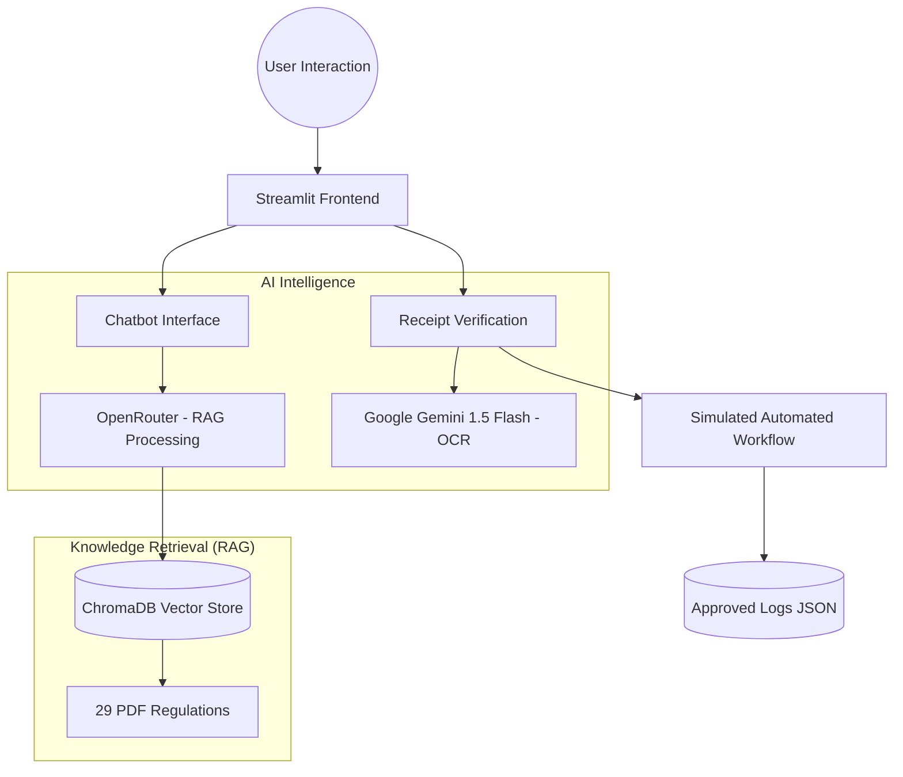

# 🎓 KMITL Budget AI Chatbot (Final Version)
> **"AI-Powered Disbursement Compliance & Intelligence for KMITL"**

[](https://kmitlbudgetaichatbot.streamlit.app/)
[](https://opensource.org/licenses/MIT)

ระบบผู้ช่วยอัจฉริยะที่ใช้พลังของ **Generative AI** ผสานกับ **RAG (Retrieval-Augmented Generation)** เพื่อตรวจสอบความถูกต้องของใบเสร็จและให้คำปรึกษาด้านระเบียบการเบิกจ่ายงบประมาณของสถาบันเทคโนโลยีพระจอมเกล้าเจ้าคุณทหารลาดกระบัง (สจล.)

---

## 🌟 ฟีเจอร์เด่น (Core Features)

### 1. 👁️ Smart OCR Verification (5-Point Check)
- ใช้ **Google Gemini 1.5 Flash** ในการสกัดข้อมูลภาษาไทยจากใบเสร็จ (Receipts/Tax Invoices)
- ตรวจสอบเกณฑ์ **"5 จุดตาย"** อัตโนมัติ (ผู้ขาย, วันที่, ยอดเงิน, รายการ, ลายเซ็น)
- รองรับทั้งการอัปโหลดไฟล์และ **การเปิดกล้องมือถือ** เพื่อสแกนหน้างาน

### 2. 💬 AI Budget Auditor (RAG Chatbot)
- ถาม-ตอบเรื่องระเบียบการเบิกจ่ายจากฐานข้อมูล **29 ฉบับ** (PDF)
- อ้างอิง **เลขหน้า และ รายข้อ** ตามระเบียบจริงของ สจล. และกระทรวงการคลัง
- ระบบ **Internal Knowledge Retrieval** ที่แม่นยำสูง (ลดการมั่วของ AI)

### 3. 📊 Admin Monitoring & Dashboard
- ติดตามสถิติการใช้งานและความพึงพอใจของผู้ใช้ (Feedback Log)
- บันทึกประวัติการส่งใบเสร็จเข้าระบบจำลอง (Approved Receipts Logging)
- แสดงผลคะแนนประสิทธิภาพ RAG (Faithfulness, Relevance, Precision)

### 4. 📱 Mobile-First Experience
- ออกแบบ UI ให้รองรับหน้าจอโทรศัพท์มือถือแบบสมบูรณ์
- ปุ่มกดขนาดใหญ่ ใช้งานง่าย พร้อมระบบสลับธีมสีคลาสสิกขาว-แดง สจล.

---

## 🏗️ สถาปัตยกรรมระบบ (Architecture)



---

## 🛠️ เทคโนโลยีที่ใช้ (Tech Stack)

| Component | Technology |
|---|---|
| **Frontend** | Streamlit |
| **Language Model** | Gemma 3 (via OpenRouter API) |
| **OCR Model** | Google Gemini 1.5 Flash (via Generative AI SDK) |
| **Vector Database** | ChromaDB (Native Python Embedding) |
| **Document Loader** | PyPDFLoader (LangChain) |
| **Communication** | Python 3.10+ |

---

## 🚀 การติดตั้งและใช้งาน (Installation)

1. **Clone repository:**
   ```bash
   git clone https://github.com/Ratthabhumi/CEIPP.git
   cd CEIPP
   ```

2. **ติดตั้ง Dependencies:**
   ```bash
   pip install -r requirements.txt
   ```

3. **ตั้งค่า API Keys:**
   สร้างไฟล์ `.streamlit/secrets.toml` หรือระบุใน Sidebar:
   ```toml
   OPENROUTER_API_KEY = "your_openrouter_key"
   GEMINI_API_KEY = "your_gemini_key"
   ```

4. **รันแอปพลิเคชัน:**
   ```bash
   streamlit run app.py
   ```

---

## 📑 รายการเอกสารอ้างอิงในระบบ (Included Regulations)
ขณะนี้ระบบรองรับระเบียบการเบิกจ่ายทั้งหมด **29 ฉบับ** ครอบคลุม:
- ✅ ระเบียบพัสดุ สจล. (2560-2562)
- ✅ ระเบียบค่าใช้จ่ายในการเดินทางไปราชการ
- ✅ ระเบียบการเบิกจ่ายเงินรางวัลวิจัย
- ✅ ระเบียบค่าใช้จ่ายในการจัดฝึกอบรม/สัมมนา
- ✅ ข้อบังคับการเงินและทรัพย์สิน สจล.

---

## 📬 ติดต่อ / ผู้ดูแล
- **Project:** KMITL Budget AI Chatbot (CEIPP)
- **Status:** Final Production (Ready for Deployment)

---
*Created with ❤️ by the CEIPP Team*
